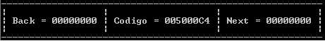

# Pilha.c
Projeto pilha

*Feito na aula de estrutura de dados da Fatec Americana

25/10/2019: 
 - Criação do Doc.c
 - Criação da Função PUSH (Insert)
 - Criação da Função TOP  (View)
 - Criação da função POP  (Delete)
 - *extra* View All
